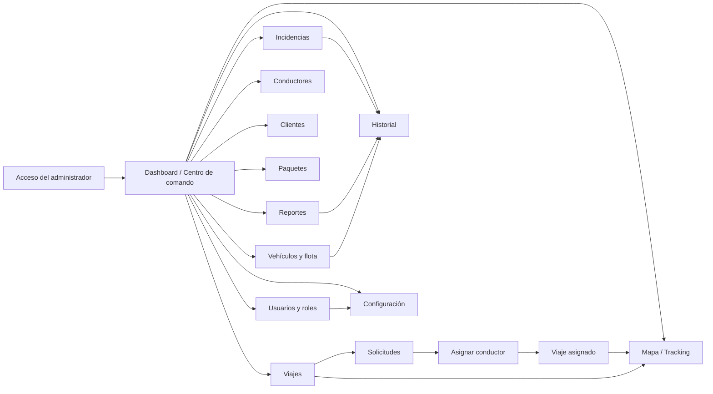

# INCOEX Web · flujo de navegación, roles y contrato de datos

Este documento acompaña al panel de superadministración en `web/`. Describe el flujo exacto de navegación, qué ocurre en cada acción operativa, qué ve cada rol, y la definición de los indicadores del dashboard, para que el equipo de desarrollo no tenga que adivinar el comportamiento del negocio.

## Mapa de navegación

## Flujo exacto por módulo

### Dashboard → Detalle
1. El administrador entra al Dashboard y recibe el resumen de la operación (ver definición de KPI abajo).
2. El panel «Requiere atención» enlaza directamente con las colas pendientes: entregas retrasadas, incidencias abiertas, solicitudes pendientes y conductores disponibles.
3. El mapa de operaciones muestra los conductores con su posición; cada marcador abre la ficha del conductor (vehículo, placa y estado).
4. Desde Viajes, cada fila abre el detalle del viaje con sus acciones de transición (ver más abajo).

### Creación de una solicitud
1. En Viajes → «Nuevo viaje» se envían cliente, paquetes, recogida, destino y descripción a `POST /api/trips`.
2. La API crea el viaje en estado **Pendiente** y lo devuelve; la fila aparece al inicio de la tabla y en la bandeja de Solicitudes.
3. La solicitud queda visible para el rol de Operaciones/Despacho.

### Aprobación y asignación
1. Solicitudes muestra la bandeja de viajes **Pendiente**.
2. «Asignar conductor» abre el módulo de asignación: lista solo conductores con estado **Disponible**.
3. `PATCH /api/trips/:id/assign` asigna el conductor, pasa el viaje a **Asignado** y cambia al conductor a **En viaje** con la ruta del despacho.
4. Si el conductor está fuera de servicio, la API rechaza la asignación y el panel lo informa.

### Ciclo de estado de un viaje
| Desde | Hacia | Acción en el panel |
|---|---|---|
| Pendiente | Asignado | Asignar conductor |
| Asignado | En camino | Detalle del viaje → «Marcar en camino» |
| En camino | En entrega | Detalle del viaje → «Marcar en entrega» |
| En entrega | Completado | Detalle del viaje → «Confirmar entrega» |
| Cualquiera activo | Cancelado | Detalle del viaje → «Cancelar viaje» |

La API valida cada transición y rechaza saltos inválidos (`PATCH /api/trips/:id/status`). Al cancelar un viaje con conductor asignado, el conductor vuelve a **Disponible**.

### Administración de vehículos y flota
1. Vehículos y flota lista placas, modelos, tipo, capacidad (kg), año, conductor asignado, estado y último mantenimiento.
2. **Registrar vehículo**: `POST /api/vehicles`; el vehículo nace **Disponible** sin conductor.
3. **Estado**: el selector por fila cambia entre Disponible, En servicio, Mantenimiento y Fuera de servicio (`PATCH /api/vehicles/:id/status`).
4. **Conductor**: el selector asigna o libera el conductor del vehículo (`PATCH /api/vehicles/:id/driver`); no se permite asignar vehículos en mantenimiento o fuera de servicio.
5. **Mantenimiento**: registrar un servicio pasa el vehículo a **Mantenimiento** y lo registra en el historial (`POST /api/vehicles/:id/maintenance`).
6. El historial completo de mantenimiento se consulta en `GET /api/vehicles/maintenance`.

### Administración de usuarios y roles
1. Usuarios y roles muestra la matriz de los **ocho roles contractuales** con sus permisos.
2. La tabla de usuarios permite: cambiar rol (selector), activar/desactivar (`PATCH /api/admin/users/:id`) y crear usuarios (`POST /api/admin/users`).
3. Solo el rol **Administrador General** gestiona usuarios y permisos. Gerencia y Finanzas pueden consultar y exportar reportes; Soporte atiende incidencias; Operaciones despacha; Conductor opera su jornada; Usuario Corporativo solicita y da seguimiento; Tienda valida cargas.

### Incidencias
1. Incidencias lista las contingencias con tipo, prioridad y estado.
2. Las incidencias abiertas y en proceso alimentan el contador del sidebar y el panel «Requiere atención».
3. Las incidencias de tipo Retraso sin resolver se contabilizan en **Entregas retrasadas** del dashboard.

### Reportes y exportación
1. Reportes agrega viajes por semana, entregas por día, top de conductores y top de clientes; cada gráfico tiene una nota que explica qué representa.
2. La exportación CSV descarga los datos reales de la API (`GET /api/reports/export/trips|drivers|clients|incidents`) con columnas documentadas en el panel.
3. Los permisos de exportación los define el rol: Gerencia y Finanzas pueden exportar.

## Definición de KPI del dashboard

| Indicador | Definición | Fuente |
|---|---|---|
| Viajes de hoy | Solicitudes creadas en el día operativo | `GET /api/dashboard/summary` |
| Viajes en curso | Viajes con estado Asignado, En camino o En entrega | Resumen de la API |
| Pendientes | Solicitudes en estado Pendiente (sin conductor) | Resumen de la API |
| Entregas completadas | Viajes en estado Completado en el día | Resumen de la API |
| Conductores activos | Disponibles + En viaje + En entrega | Resumen de la API |
| Conductores disponibles | Conductores en estado Disponible | Resumen de la API |
| Clientes registrados / activos | Cuentas totales / cuentas con operación reciente | Resumen de la API |
| Paquetes en tránsito | Suma de paquetes de todos los viajes en curso | Resumen de la API |
| Entregas retrasadas | Viajes con incidencia de retraso abierta | Resumen de la API |
| Incidencias abiertas | Incidencias en estado Abierta o En proceso | Resumen de la API |

**Diferencia entre «Viajes en curso» y «Paquetes en tránsito»**: un viaje en curso transporta uno o varios paquetes. «Viajes en curso» cuenta despachos (una fila por viaje); «Paquetes en tránsito» suma el campo `packages` de esos viajes. Si un viaje tiene 5 paquetes, aporta 1 al primer indicador y 5 al segundo.

## Inventario de pantallas del panel

| Módulo | Propósito | Estado de integración |
|---|---|---|
| Dashboard | KPIs con definición, panel de atención, mapa y actividad | Conectado a `dashboard`, `trips`, `drivers` e `history` |
| Viajes | Tabla, detalle con transiciones de estado, búsqueda y alta | Conectado a `GET/POST /api/trips` y `PATCH /api/trips/:id/status` |
| Solicitudes | Bandeja de viajes pendientes | Derivada de `GET /api/trips` |
| Asignar conductor | Selección de conductor disponible | Asignación conectada a `PATCH /api/trips/:id/assign` |
| Conductores | Flota humana, vehículo, ruta y disponibilidad | Conectado a `GET /api/drivers` |
| Vehículos y flota | Registro, estado, conductor, mantenimiento y capacidad | Conectado a `/api/vehicles` completo |
| Clientes | Cuentas corporativas, contacto y viajes | Conectado a `GET /api/clients` |
| Paquetes | Guías derivadas de viajes con peso, dimensiones y estado | Derivado de `GET /api/trips`; evidencias pendientes |
| Mapa / Tracking | Vista de operaciones y posiciones | Conectado al resumen; proveedor cartográfico real pendiente |
| Historial | Línea de tiempo de eventos | Conectado a `GET /api/history` |
| Incidencias | Priorización y seguimiento de contingencias | Conectado a `GET /api/incidents`; resolución pendiente |
| Reportes | KPIs, tendencias, rankings y exportación CSV real | Conectado a `GET /api/reports/summary` y `/api/reports/export/*` |
| Usuarios y roles | Matriz de 8 roles y administración de usuarios | Conectado a `/api/admin/users` y `/api/admin/roles` |
| Configuración | Estado de API, mapas y seguridad | Vista de estado; configuración persistente pendiente |

## Endpoints consumidos

| Endpoint | Consumidor |
|---|---|
| `GET /api/dashboard/summary` | Dashboard |
| `GET /api/trips` | Dashboard, Viajes, Solicitudes, Paquetes |
| `POST /api/trips` | Formulario de nuevo viaje |
| `PATCH /api/trips/:id/assign` | Asignar conductor |
| `PATCH /api/trips/:id/status` | Detalle del viaje (transiciones) |
| `GET /api/drivers` | Dashboard, Conductores, Asignación, Vehículos |
| `GET/POST /api/vehicles` · `PATCH /api/vehicles/:id/status` · `PATCH /api/vehicles/:id/driver` · `POST /api/vehicles/:id/maintenance` · `GET /api/vehicles/maintenance` | Vehículos y flota |
| `GET /api/admin/users` · `POST /api/admin/users` · `PATCH /api/admin/users/:id` | Usuarios y roles |
| `GET /api/admin/roles` | Usuarios y roles (matriz) |
| `GET /api/clients` | Clientes |
| `GET /api/incidents` | Incidencias |
| `GET /api/history` | Dashboard, Historial |
| `GET /api/reports/summary` | Reportes |
| `GET /api/reports/export/:collection` | Exportación CSV |
| `GET /api/tracking/overview` | Mapa / Tracking |

## Regla de datos

El frontend no usa arreglos de demostración como respaldo: si la API no está disponible, muestra el estado de conexión y una vista de error. Los datos de muestra viven únicamente en los stores del backend (`OperationsStore`, `VehiclesStore`, `UsersStore`) para poder presentar el flujo mientras se conecta PostgreSQL. Todos los datos de demostración corresponden a Managua, Nicaragua.

## Pendiente para producción

Antes de producción faltan autenticación JWT/RBAC real (el login del panel sigue siendo de demo), PostgreSQL, paginación y filtros persistentes, WebSockets para posiciones en vivo, almacenamiento de evidencias (fotos, firmas, comprobante PDF), notificaciones y pruebas E2E.