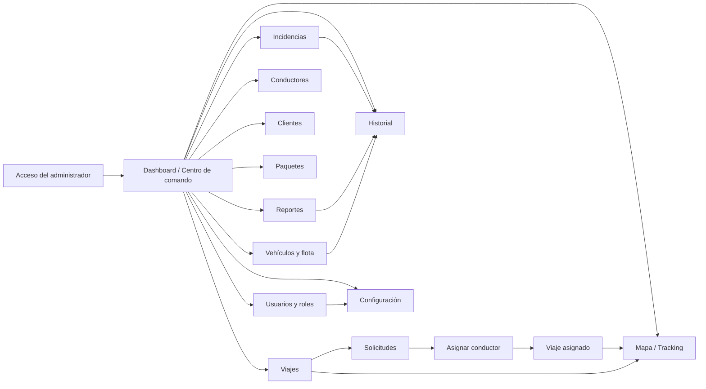

# INCOEX Web · flujo de navegación, roles y contrato de datos

Este documento acompaña al panel de superadministración en `web/`. Describe el flujo exacto de navegación, qué ocurre en cada acción operativa, qué ve cada rol, y la definición de los indicadores del dashboard, para que el equipo de desarrollo no tenga que adivinar el comportamiento del negocio.

## Mapa de navegación

## Flujo exacto por módulo

### Dashboard → Detalle
1. El administrador entra al Dashboard y recibe el resumen de la operación (ver definición de KPI abajo).
2. El panel «Requiere atención» enlaza directamente con las colas pendientes: entregas retrasadas, incidencias abiertas, solicitudes pendientes y conductores disponibles.
3. El mapa de operaciones muestra los conductores con su posición; cada marcador abre la ficha del conductor (vehículo, placa y estado).
4. Desde Viajes, cada fila abre el detalle del viaje con sus acciones de transición (ver más abajo).

### Creación de una solicitud (asistente de cuatro pasos)
1. En Viajes → «Nuevo viaje» se abre un asistente con cuatro pasos que termina en `POST /api/trips`.
2. **Cliente y servicio**: cliente (obligatorio), contacto, teléfono, tipo de servicio (Urbano, Express, Programado), paquetes, carga frágil y descripción.
3. **Ruta en el mapa**: se escriben recogida y destino, y cada campo tiene el botón «Buscar en el mapa» (geocodificación sobre Google Maps); también se pueden colocar los puntos con clic o arrastrar los marcadores. La distancia se calcula en línea recta (haversine) y se muestra la tarifa estimada en córdobas y su equivalente en dólares según la tasa de Configuración.
4. **Destinatario y carga**: nombre y teléfono del destinatario (para la notificación desde la app móvil).
5. **Confirmar**: resumen de cliente, ruta, destinatario y tarifa estimada (`tarifa base + km × tarifa por km`). Al crear, la API guarda las coordenadas y la distancia (`origin_lat`, `destination_lng`, `distance_km`, `estimated_cost_cs`, `service_type`, `contact_*`).
6. El viaje se crea en estado **Pendiente** y aparece al inicio de la tabla y en la bandeja de Solicitudes. Su detalle muestra la ruta en el mapa y la tarifa con conversión a dólares.

### Ciclo de datos (CRUD completo)
Todos los módulos operativos permiten jugar con los datos reales de la API (SQLite local):

| Módulo | Crear | Leer | Actualizar | Eliminar |
|---|---|---|---|---|
| Viajes | Asistente con mapa | Tabla + detalle | Transiciones de estado | `DELETE /api/trips/:id` (libera al conductor) |
| Conductores | «Agregar conductor» | Tarjetas + perfil | — | `DELETE /api/drivers/:id` (bloqueado con viajes activos) |
| Vehículos | «Registrar vehículo» | Tabla + detalle | Estado, conductor, datos económicos, foto | `DELETE /api/vehicles/:id` (requiere conductor liberado) |
| Clientes | «Nuevo cliente» | Tabla | — | `DELETE /api/clients/:id` |
| Usuarios | «Crear usuario» | Tabla | Rol y activación | `DELETE /api/admin/users/:id` (el administrador principal está protegido) |
| Incidencias | «Reportar incidencia» | Tabla + detalle | Abierta → En proceso → Resuelta | — |

### Datos coherentes del dashboard
El resumen del dashboard se calcula **sin inflar**: cada número proviene de los registros reales (viajes, conductores, clientes e incidencias). «Conductores disponibles», «Solicitudes pendientes» e «Incidencias abiertas» muestran exactamente lo mismo que sus listados, y los KPI son navegables hacia su módulo. La campana de notificaciones lista las incidencias abiertas y las solicitudes pendientes reales.

### Aprobación y asignación
1. Solicitudes muestra la bandeja de viajes **Pendiente**.
2. «Asignar conductor» abre el módulo de asignación: lista solo conductores con estado **Disponible**.
3. `PATCH /api/trips/:id/assign` asigna el conductor, pasa el viaje a **Asignado** y cambia al conductor a **En viaje** con la ruta del despacho.
4. Si el conductor está fuera de servicio, la API rechaza la asignación y el panel lo informa.

### Ciclo de estado de un viaje
| Desde | Hacia | Acción en el panel |
|---|---|---|
| Pendiente | Asignado | Asignar conductor |
| Asignado | En camino | Detalle del viaje → «Marcar en camino» |
| En camino | En entrega | Detalle del viaje → «Marcar en entrega» |
| En entrega | Completado | Detalle del viaje → «Confirmar entrega» |
| Cualquiera activo | Cancelado | Detalle del viaje → «Cancelar viaje» |

La API valida cada transición y rechaza saltos inválidos (`PATCH /api/trips/:id/status`). Al cancelar un viaje con conductor asignado, el conductor vuelve a **Disponible**.

### Administración de vehículos y flota
1. Vehículos y flota lista fotos, placas, modelos, tipo, consumo de combustible, precio de compra en córdobas, costo por km, conductor asignado y estado.
2. **Registrar vehículo**: `POST /api/vehicles`; además de placa, modelo, tipo, capacidad y año, se capturan combustible (Gasolina, Diésel, Eléctrico, Híbrido), consumo en L/km, precio de compra en C$ y odómetro. El vehículo nace **Disponible** sin conductor.
3. **Datos económicos**: el botón de combustible abre la edición de consumo, precio (C$) y odómetro (`PATCH /api/vehicles/:id`). El costo por km se recalcula con el precio del combustible de Configuración: `consumo × precio por litro (C$)`.
4. **Fotos**: el botón de cámara sube la foto del vehículo (`POST /api/vehicles/:id/image`, jpg/png/webp/gif, máx 5 MB) y se sirve desde `GET /api/uploads/vehicles/:file`. El detalle muestra la foto en grande.
5. **Conversión a dólares**: cada precio en C$ se acompaña de su equivalente en US$ usando la tasa de Configuración (por ejemplo, C$ 1.850.000 ≈ US$ 50.684 con tasa 36,50).
6. **Estado**: el selector por fila cambia entre Disponible, En servicio, Mantenimiento y Fuera de servicio (`PATCH /api/vehicles/:id/status`).
7. **Conductor**: el selector asigna o libera el conductor del vehículo (`PATCH /api/vehicles/:id/driver`); no se permite asignar vehículos en mantenimiento o fuera de servicio.
8. **Mantenimiento**: registrar un servicio (con costo en C$) pasa el vehículo a **Mantenimiento** y lo registra en el historial (`POST /api/vehicles/:id/maintenance`).
9. El historial completo de mantenimiento se consulta en `GET /api/vehicles/maintenance` y por vehículo dentro del detalle.

### Configuración: moneda y tarifas
1. Configuración muestra el estado de conexión y la tarjeta **Moneda y tarifas** con cinco valores editables: tasa de cambio (C$ por US$ 1), precio de gasolina y diésel por litro (C$), tarifa base por viaje y tarifa por kilómetro.
2. `PATCH /api/settings` persiste los cambios y el panel recalcula en vivo: equivalencia del dólar, costo de un viaje de ejemplo y precio del litro en dólares.
3. La tasa y las tarifas alimentan toda la operación: conversión de precios de flota, costo por km de cada vehículo y tarifa estimada de los viajes nuevos.

### Administración de usuarios y roles
1. Usuarios y roles muestra la matriz de los **ocho roles contractuales** con sus permisos.
2. La tabla de usuarios permite: cambiar rol (selector), activar/desactivar (`PATCH /api/admin/users/:id`) y crear usuarios (`POST /api/admin/users`).
3. Solo el rol **Administrador General** gestiona usuarios y permisos. Gerencia y Finanzas pueden consultar y exportar reportes; Soporte atiende incidencias; Operaciones despacha; Conductor opera su jornada; Usuario Corporativo solicita y da seguimiento; Tienda valida cargas.

### Incidencias
1. Incidencias lista las contingencias con tipo, prioridad y estado.
2. Las incidencias abiertas y en proceso alimentan el contador del sidebar y el panel «Requiere atención».
3. Las incidencias de tipo Retraso sin resolver se contabilizan en **Entregas retrasadas** del dashboard.

### Reportes y exportación
1. Reportes calcula la analítica desde los viajes reales: total, entregadas, canceladas, ingresos estimados (C$), kilómetros recorridos, distancia promedio, actividad por fecha, top de conductores y top de clientes.
2. La exportación genera **Excel** (archivo .xlsx real con SheetJS) y **PDF** (ventana de impresión) para viajes, conductores, clientes, incidencias y paquetes.
3. Los permisos de exportación los define el rol: Gerencia y Finanzas pueden exportar.

## Definición de KPI del dashboard

| Indicador | Definición | Fuente |
|---|---|---|
| Viajes de hoy | Solicitudes con fecha de hoy | `GET /api/dashboard/summary` (calculado de `trips`) |
| Viajes en curso | Viajes con estado Asignado, En camino o En entrega | Calculado de `trips` |
| Pendientes | Solicitudes en estado Pendiente (sin conductor) | Calculado de `trips` |
| Entregas completadas | Viajes Completados con fecha de hoy | Calculado de `trips` |
| Conductores activos | Conductores con estado distinto de Fuera de servicio | Calculado de `drivers` |
| Conductores disponibles | Conductores en estado Disponible | Calculado de `drivers` |
| Clientes registrados / activos | Cuentas totales / cuentas Activas | Calculado de `clients` |
| Paquetes en tránsito | Suma de paquetes de los viajes en curso | Calculado de `trips` |
| Entregas retrasadas | Incidencias de Retraso no resueltas | Calculado de `incidents` |
| Incidencias abiertas | Incidencias en estado Abierta o En proceso | Calculado de `incidents` |

**Diferencia entre «Viajes en curso» y «Paquetes en tránsito»**: un viaje en curso transporta uno o varios paquetes. «Viajes en curso» cuenta despachos (una fila por viaje); «Paquetes en tránsito» suma el campo `packages` de esos viajes. Si un viaje tiene 5 paquetes, aporta 1 al primer indicador y 5 al segundo.

## Inventario de pantallas del panel

| Módulo | Propósito | Estado de integración |
|---|---|---|
| Dashboard | KPIs con definición, panel de atención, mapa y actividad | Conectado a `dashboard`, `trips`, `drivers` e `history` |
| Viajes | Tabla, detalle con transiciones de estado, ruta en el mapa, tarifa estimada y asistente de alta | Conectado a `GET/POST /api/trips`, `PATCH /api/trips/:id/status` y Google Maps |
| Solicitudes | Bandeja de viajes pendientes | Derivada de `GET /api/trips` |
| Asignar conductor | Selección de conductor disponible | Asignación conectada a `PATCH /api/trips/:id/assign` |
| Conductores | Flota humana, vehículo, ruta y disponibilidad | Conectado a `GET /api/drivers` |
| Vehículos y flota | Fotos, consumo, precios C$/USD, costo por km, estado, conductor y mantenimiento | Conectado a `/api/vehicles` completo y `/api/uploads/vehicles/*` |
| Clientes | Cuentas corporativas, contacto y viajes | Conectado a `GET /api/clients` |
| Paquetes | Guías derivadas de viajes con peso, dimensiones y estado | Derivado de `GET /api/trips`; evidencias pendientes |
| Mapa / Tracking | Vista de operaciones y posiciones | Conectado al resumen; posiciones GPS de producción pendientes |
| Historial | Línea de tiempo de eventos | Conectado a `GET /api/history` |
| Incidencias | Priorización y seguimiento de contingencias | Conectado a `GET /api/incidents`; resolución pendiente |
| Reportes | KPIs, tendencias, rankings y exportación CSV real | Conectado a `GET /api/reports/summary` y `/api/reports/export/*` |
| Usuarios y roles | Matriz de 8 roles y administración de usuarios | Conectado a `/api/admin/users` y `/api/admin/roles` |
| Configuración | Estado de API, mapas, seguridad y tarjeta Moneda y tarifas | Conectado a `GET/PATCH /api/settings` |

## Endpoints consumidos

| Endpoint | Consumidor |
|---|---|
| `GET /api/dashboard/summary` | Dashboard |
| `GET /api/trips` | Dashboard, Viajes, Solicitudes, Paquetes |
| `POST /api/trips` | Asistente de nuevo viaje (coordenadas, distancia, tarifa) |
| `PATCH /api/trips/:id/assign` | Asignar conductor |
| `PATCH /api/trips/:id/status` | Detalle del viaje (transiciones) |
| `GET /api/drivers` | Dashboard, Conductores, Asignación, Vehículos |
| `GET/POST /api/vehicles` · `PATCH /api/vehicles/:id` (datos económicos) · `PATCH /api/vehicles/:id/status` · `PATCH /api/vehicles/:id/driver` · `POST /api/vehicles/:id/maintenance` · `POST /api/vehicles/:id/image` · `GET /api/vehicles/maintenance` | Vehículos y flota |
| `GET /api/uploads/vehicles/:file` | Fotos de la flota |
| `GET/PATCH /api/settings` | Configuración (tasa de cambio, combustible, tarifas) |
| `GET /api/admin/users` · `POST /api/admin/users` · `PATCH /api/admin/users/:id` | Usuarios y roles |
| `GET /api/admin/roles` | Usuarios y roles (matriz) |
| `GET /api/clients` | Clientes |
| `GET /api/incidents` | Incidencias |
| `GET /api/history` | Dashboard, Historial |
| `GET /api/reports/summary` | Reportes |
| `GET /api/reports/export/:collection` | Exportación CSV |
| `GET /api/tracking/overview` | Mapa / Tracking |

## Regla de datos

El frontend no usa arreglos de demostración como respaldo: si la API no está disponible, muestra el estado de conexión y una vista de error. Los datos de muestra viven únicamente en los stores del backend (`OperationsStore`, `VehiclesStore`, `UsersStore`, `SettingsStore`) para poder presentar el flujo mientras se conecta PostgreSQL. Todos los datos de demostración corresponden a Managua, Nicaragua, y los precios están en córdobas (C$) con la tasa de cambio definida en Configuración.

## Despliegue actual

| Componente | URL | Notas |
|---|---|---|
| API | https://plt-api-01-sep-sn.onrender.com/api | Render (plan gratuito: se duerme sin tráfico, la primera petición puede tardar ~40 s) |
| Panel web | https://plt-web-01-sep-sn.vercel.app | Vercel · consume la API de Render (CORS habilitado) |
| Salud de la API | https://plt-api-01-sep-sn.onrender.com/api/health | Verificación rápida del servicio |

**Base de datos en Render**: la API usa SQLite dentro del contenedor. El disco de Render es efímero: cada deploy o reinicio borra la base y las fotos subidas, y los datos vuelven a sembrarse. Para mantener los datos entre deploys sin cambiar de motor: montar un *persistent disk* en Render y definir `INCOEX_DB_PATH=/var/data/incoex-local.sqlite` y `INCOEX_UPLOADS_PATH=/var/data/uploads/vehicles` (el código ya respeta ambas variables; ver `api-incoex/.env.example`). Para producción real se migrará a PostgreSQL.

**Desarrollo local**: la web respeta `VITE_API_URL`; sin esa variable usa la API de Render. Para trabajar local: levantar la API (`npm run start:dev`) y `VITE_API_URL=http://localhost:3000/api` en la web.

## Pendiente para producción

Antes de producción faltan autenticación JWT/RBAC real (el login del panel sigue siendo de demo), PostgreSQL, WebSockets para posiciones en vivo, ETA con rutas viales reales (hoy la distancia se calcula en línea recta), pagos de clientes, almacenamiento de evidencias (fotos de paquetes, firmas, comprobante PDF), notificaciones push y pruebas E2E automatizadas.