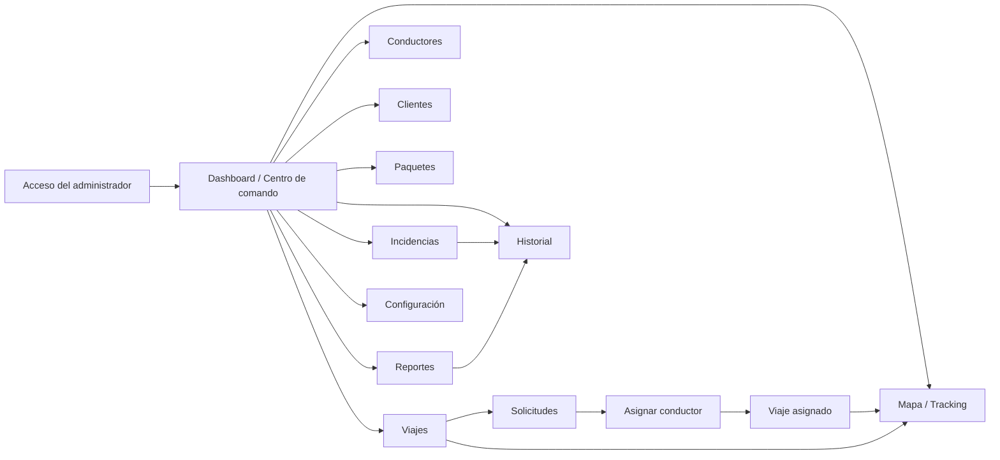

# INCOEX Web · flujo de navegación y contrato de datos

Este documento acompaña al panel de superadministración en `web/`. El objetivo es que las pantallas de referencia, el flujo de navegación y la fuente de datos puedan presentarse juntos.

## Mapa de navegación

## Inventario de pantallas del panel

La navegación actual contempla los módulos mostrados en las referencias visuales:

| Módulo | Propósito | Estado de integración |
|---|---|---|
| Dashboard | KPIs, mapa de operaciones y actividad reciente | Conectado a `dashboard`, `trips`, `drivers` e `history` |
| Viajes | Tabla de viajes, estados, búsqueda y alta de viaje | Lectura conectada; alta conectada mediante formulario |
| Solicitudes | Bandeja de viajes pendientes | Derivada de `GET /api/trips` |
| Asignar conductor | Selección de conductor disponible | Asignación conectada a `PATCH /api/trips/:id/assign` |
| Conductores | Flota, vehículo, ruta y disponibilidad | Conectado a `GET /api/drivers` |
| Clientes | Cuentas corporativas, contacto y viajes | Conectado a `GET /api/clients` |
| Paquetes | Inventario operativo derivado de viajes | Derivado de `GET /api/trips`; CRUD de paquetes pendiente |
| Mapa / Tracking | Vista de operaciones y posiciones | Conectado al resumen; proveedor cartográfico real pendiente |
| Historial | Línea de tiempo de eventos | Conectado a `GET /api/history` |
| Incidencias | Priorización y seguimiento de contingencias | Conectado a `GET /api/incidents`; acciones de resolución pendientes |
| Reportes | KPIs, tendencias y rankings | Conectado a `GET /api/reports/summary` |
| Configuración | Estado de API, mapas y seguridad | Vista de estado; configuración persistente pendiente |

## Flujo operativo principal

1. El administrador entra al Dashboard y recibe un resumen de la operación.
2. Una solicitud aparece en Viajes y Solicitudes con origen, destino, cliente y paquetes.
3. En Asignar conductor se consultan los conductores disponibles.
4. La acción de asignación actualiza el viaje en NestJS y refresca la flota.
5. Mapa / Tracking muestra los viajes activos, sus conductores e incidencias.
6. Historial y Reportes consolidan los eventos y métricas entregados por la API.

## Endpoints consumidos

| Endpoint | Consumidor |
|---|---|
| `GET /api/dashboard/summary` | Dashboard |
| `GET /api/trips` | Dashboard, Viajes, Solicitudes, Paquetes |
| `POST /api/trips` | Formulario de nuevo viaje |
| `PATCH /api/trips/:id/assign` | Asignar conductor |
| `GET /api/drivers` | Dashboard, Conductores, Asignación |
| `GET /api/clients` | Clientes |
| `GET /api/incidents` | Incidencias |
| `GET /api/history` | Dashboard, Historial |
| `GET /api/reports/summary` | Reportes |
| `GET /api/tracking/overview` | Mapa / Tracking |

## Regla de datos

El frontend no usa arreglos de demostración como respaldo: si la API no está disponible, muestra el estado de conexión y una vista de error. Los datos de muestra actuales viven únicamente en el `OperationsStore` temporal del backend para poder presentar el flujo mientras se conecta PostgreSQL.

## Pendiente para producción

La experiencia visual y el contrato inicial están montados. Antes de producción faltan autenticación JWT/RBAC real, PostgreSQL, paginación y filtros persistentes, WebSockets para posiciones en vivo, proveedor de mapas, almacenamiento de evidencias, notificaciones y pruebas E2E.
